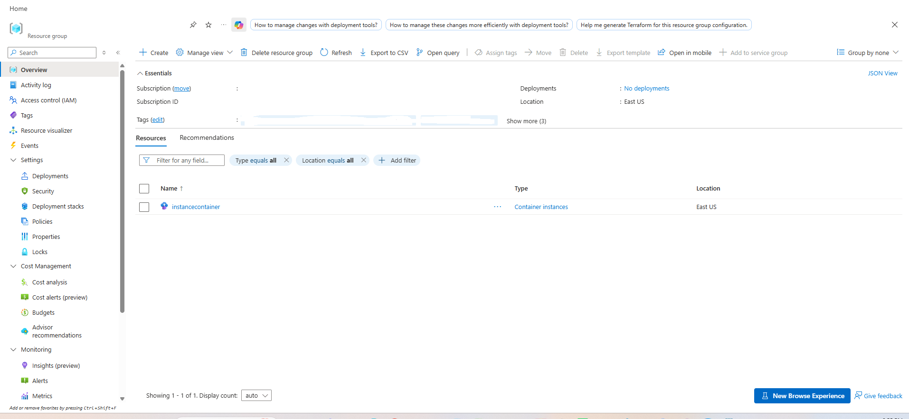
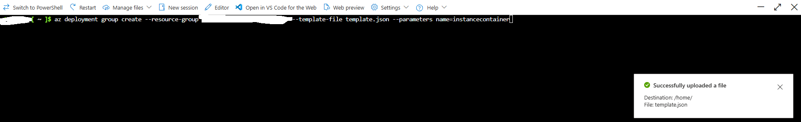
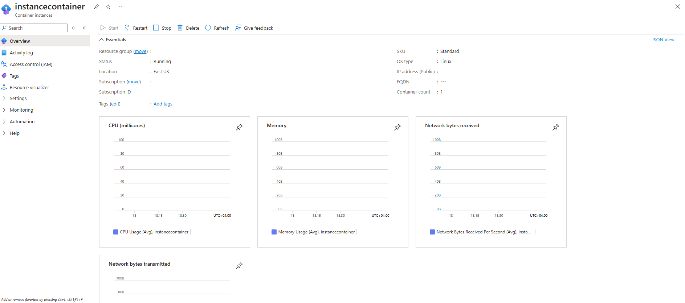
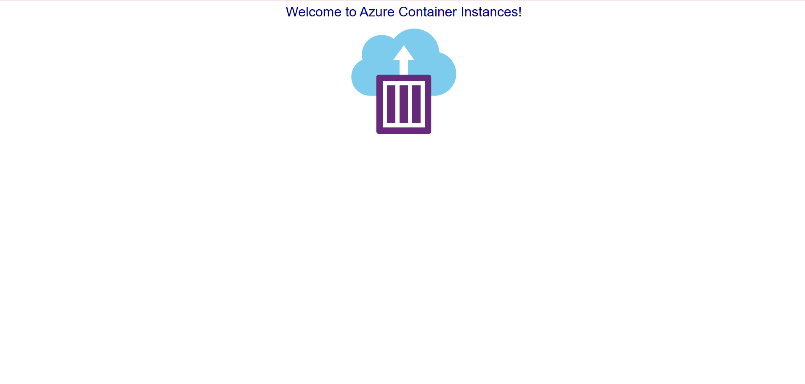

# Declarative Azure Container Instance Deployment via ARM Template Lab

Implementation documenting the declarative provisioning, resource validation, and web workload verification of an Azure Container Instance (instancecontainer) using an Azure Resource Manager (ARM) template in the East US region.

---

## 1. Architecture & Provisioned Resources

All lab infrastructure was provisioned in the East US region under a dedicated resource group:

* Container group: instancecontainer - Standard SKU Linux container group configured with 1 vCPU, 2 GB memory, restart policy Always, and public IP allocation
* Container image: mcr.microsoft.com/azuredocs/aci-helloworld - Sample web workload exposing HTTP port 80
* Public endpoint: Public IP address exposing port 80 for external web access

*Resource group overview confirming the provisioned container instance resource.*

---

## 2. Implementation & Deployment

### Step 1: Upload and Deploy ARM Template via Azure CLI

Uploaded template.json to Cloud Shell and executed an Azure Resource Manager group deployment, supplying instancecontainer as the target container group name parameter.

*Cloud Shell confirmation of uploaded template.json and execution of the az deployment group create command.*

---

### Step 2: Verify Container Instance Deployment in Azure Portal

Inspected instancecontainer in the Azure Portal to confirm that the container group transitioned to Running status with a Succeeded provisioning state on the Standard SKU.

*Portal essentials view verifying running state, Linux OS type, and allocated public IP.*

---

### Step 3: Validate Active Web Application

Accessed the public IP address in a web browser to confirm that the deployed container was actively listening on port 80 and serving the web application.

*Browser confirmation rendering the Welcome to Azure Container Instances! landing page.*

